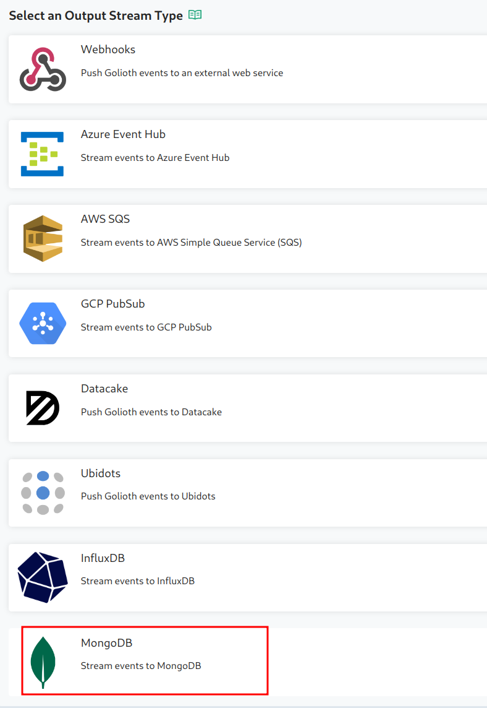
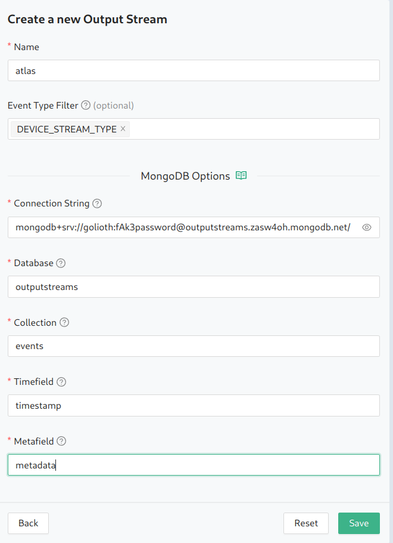

[MongoDB Cloud](https://www.mongodb.com/) is a document database and has
support for timeseries collections, which can be used to consume Golioth
events in a simple, trusted, and scalable way. Golioth's Output Stream for
MongoDB Cloud allows you to transform Golioth events into MongoDB's native
BSON document and ingest them in your MongoDB instance.

## MongoDB Specific Attributes

For each Output Stream type, there is a set of specified attributes. Here are
the ones for MongoDB:

| Attribute          | Type   | Required | Description |
| ------------------ | ------ |:--------:| ----------- |
| Name | string | ✅        | Name to identify the Output Stream |
| Event Type Filter | string | ✅        | Select `DEVICE_STREAM_TYPE` |
| Connection String| string | ✅        | Connection string containing username and password |
| Database| string | ✅        | Name of the MongoDB database |
| Collection| string | ✅        | Name of the MongoDB collection |
| Timefield| string | ✅        | Name to use for the timefield in the BSON document (e.g. "timestamp")|
| Metafield| string | ✅        | Name to use for the metafield in the BSON document (e.g. "metadata")|

## Overview

To use this integration, you need to:

- Have a MongoDB instance (either a standalone instance or in Atlas, Mongo's managed service)
- Create a MongoDB user that has a username and password
- Create a timeseries collection in your MongoDB database
- (Optional) Whitelist Golioth's IP address in your Atlas deployment
- Create an instance of the MongoDB Output Stream in your Golioth account

## Setup the MongoDB Output Stream

### 1. Setup a MongoDB deployment

If you're using MongoDB Atlas, see the [Getting Started with Atlas](https://www.mongodb.com/docs/atlas/getting-started/) tutorial.

If you're using a local MongoDB installation, see the [Install MongoDB](https://www.mongodb.com/docs/manual/installation/#std-label-tutorial-installation) tutorial.

### 2. Create a MongoDB database user

If you are using MongoDB Atlas, see [Create a Database User for Your Cluster](https://www.mongodb.com/docs/atlas/tutorial/create-mongodb-user-for-cluster/).

### 3. Create a timeseries collection


### 4. Get the MongoDB connection string

### 5. Create an MongoDB Output Stream in the Golioth console

From the `Select an Output Stream Type` page, select `MongoDB`.



In the `Create a new Output Stream` form, enter the following:

* **Name**: The name you want to give to your Output Stream
* **Event Type Filter**: select `DEVICE_STREAM_TYPE` from the list of types (the
  MongoDB Output Stream is currently limited to stream events only)
* **MongoDB URL**: Paste the `Cluster URL` you copied from your MongoDB Cloud org
  settings
* **MongoDB token**: Paste the MongoDB Cloud API token
* **MongoDB bucket**: the name of an existing MongoDB Cloud bucket where you want
  to send your events
* **MongoDB measurement name**: The name of the MongoDB measurement



## Example Data

Golioth Output Streams use the [Cloud Events](https://cloudevents.io) format.
Because MongoDB is a timeseries database, we transform events from the
CloudEvents format to the MongoDB [line protocol](https://docs.influxdata.com/influxdb/cloud-serverless/reference/syntax/line-protocol/)
format.

Here is an example of a CloudEvent on the Golioth platform:
```json
Context Attributes,
  specversion: 1.0
  type: TEST_EVENT_TYPE
  source: golioth/app/api
  subject: integration
  id: 18914e4f-3620-48e2-9772-03fe12e757da
  datacontenttype: application/json
Data,
  {
    "timestamp": {
      "seconds": 1682614592,
      "nanos": 987338334
    },
    "project_id": "64230895aff1018f3aacabab",
    "integration_id": "644aa93df9021bf366e0a255",
    "data": {
      "hello": "world"
    }
  }
```

We transform the above CloudEvent to the following BSON document:

```
{
    timestamp: 2023-08-15T21:27:06.219+00:00,
    metadata: {
        device_id: "62def0a5316b32515f36fe2e",
        project_id: "64230895aff1018f3aacabab",
    },
    _id: ObjectId('64dbedaa2ee9615b83f21576'),
    data: {
        "hello": "world"
    }
}
```
