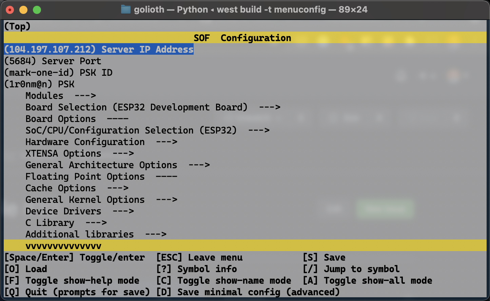

Now we're getting to the good stuff - working with hardware! The sample project provided will demonstrate a device securely communicating with Golioth and will also introduce the first device service for _logging_.

The first sample to look at is called `hello`, which logs a "hello" message using the _Logging Device Service_. Here's snippet of the `main()` function:

```cpp
void main(void)
{
	int r;
	int counter = 0;

	LOG_DBG("Start Hello sample");

	k_sem_take(&golioth_client_ready, K_FOREVER);

	while (true) {
		LOG_INF("Sending hello! %d", counter++);

		r = golioth_send_hello(client);
		if (r < 0) {
			LOG_WRN("Failed to send hello!");
		}

		k_sleep(K_SECONDS(5));
	}

	LOG_DBG("Quit");
}
```

If you're familiar with Zephyr you may recognized the `LOG_*` functions. That's because Golioth tries to use Zephyr APIs whenever it can. In this instance, the Logging Device Service is a cloud-enabled backend for Zephyr's [logging](https://docs.zephyrproject.org/latest/reference/logging/index.html) library. In this way, Golioth's can reuse well-tested libraries, reduce the size through shared code and feel idiomatic to developers who are comfortable with Zephyr.

### Building `hello`

Samples can be found in the Zephyr SDK in the folder `modules/lib/golioth/samples`. We recommend running the commands below from the `modules/lib/golioth` folder.

```
cd ~/zephyrproject/modules/lib/golioth
```

Zephyr uses [Kconfig](https://docs.zephyrproject.org/latest/guides/kconfig/index.html) to manage build settings ar scale. Kconfig values can be set a number of ways but the ncurses-based TUI is the easiest.

First build the project with the default settings:

```
west build -b esp32 samples/hello
```

Now open `menuconfig`:

```
west build -t menuconfig
```

You should see something like this:



Update the PSK & PSK ID to match what was used during the provisioning step and set the Wi-Fi network credentials.

After saving, re-build the sample with the new settings.

```
west build -b esp32 samples/hello
```

### Flashing the device

Flashing is a simple `west` command away.

```
west flash --esp-device=--esp-device=/dev/cu.usbserial-1337
```

:::note
Your ESP32 will likely be at a different location, so adjust the `flash` command accordingly.
:::

### Verify with serial output

You can verify that everything is working connecting to the device over a serial console using a tool like `screen`:

```
screen /dev/cu.usbserial-1337 115200
```

This is an snippet from the serial console:

```
[00:00:00.000,000] <dbg> golioth_hello.main: Start CoAP-client sample
[00:00:00.000,000] <inf> golioth_hello: Initializing golioth client
[00:00:00.000,000] <inf> golioth_hello: Golioth client initialized
[00:00:00.000,000] <inf> golioth_hello: Sending hello! 0
[00:00:00.000,000] <dbg> golioth_hello.main: Debug info! 1
[00:00:00.000,000] <dbg> golioth_hello.func_1: Log 1: 1
[00:00:00.000,000] <dbg> golioth_hello.func_2: Log 2: 1
[00:00:00.000,000] <wrn> golioth_hello: Warn: 1
[00:00:00.000,000] <err> golioth_hello: Err: 1
[00:00:00.000,000] <inf> golioth_hello: Starting connect
[00:00:00.000,000] <inf> golioth_hello: Client connected!
```

These are just the logs the device has created but they're also being sent to Golioth for later use. The next step will show you how to view logs from the cloud.
